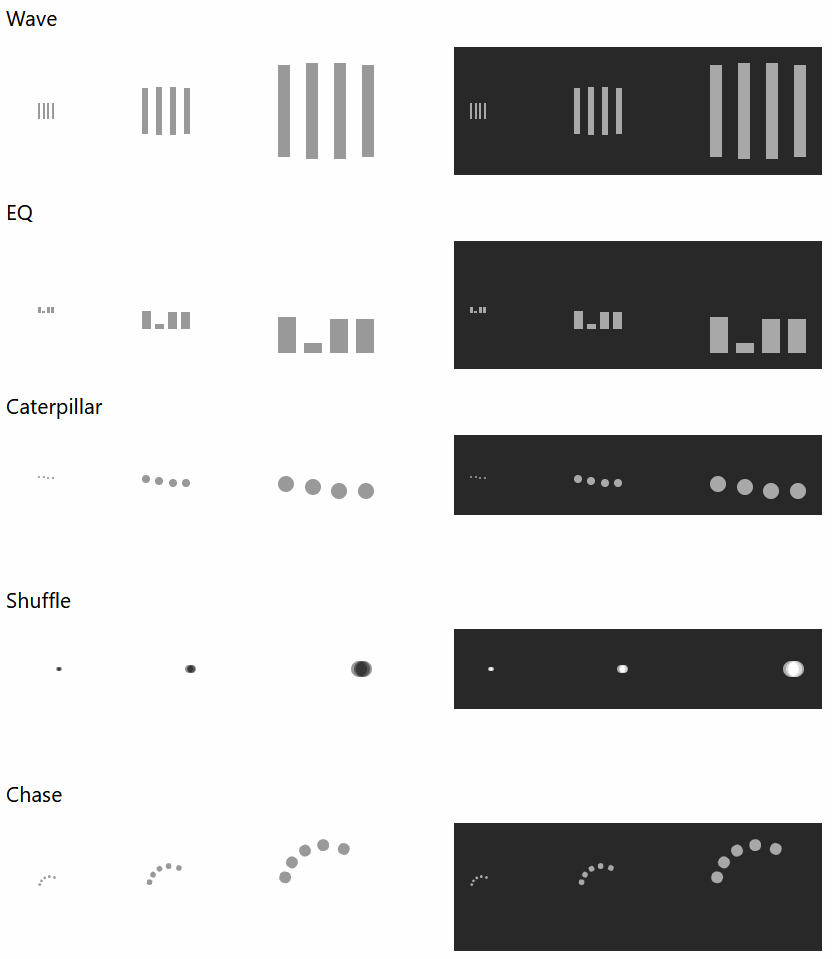

# css-spinners
A collection of CSS-based loader/spinner animations for use in web applications.  Also included are React components for each of the spinners.

[Click here](https://umamimolecule.github.io/css-spinners/) for live examples, for both light and dark modes.

